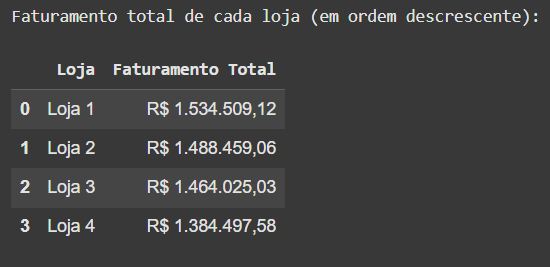
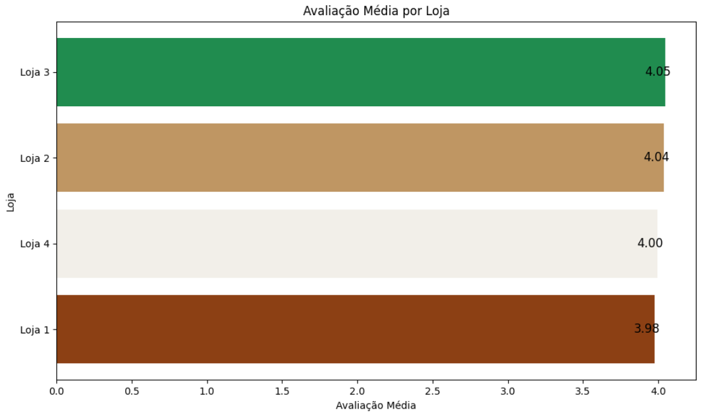
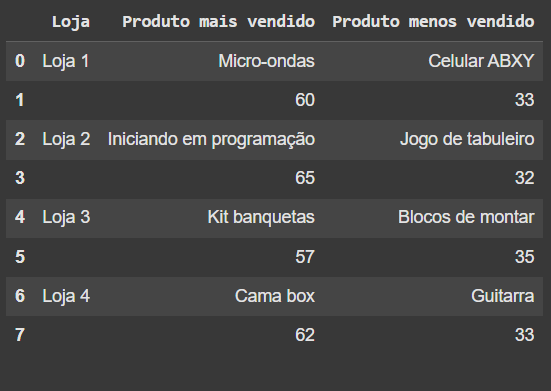
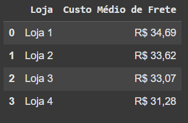

# Challenge Alura Store

## 📑 Sumário

- [Introdução do Desafio da Alura](#-introdução-do-desafio-da-alura)
- [Ferramentas utilizadas no projeto](#-ferramentas-utilizadas-no-projeto)
- [Primeira análise: Faturamento total de cada loja](#-primeira-análise-faturamento-total-de-cada-loja)
- [Segunda análise: Vendas por categoria](#-segunda-análise-vendas-por-categoria)
- [Terceira análise: Média de avaliação](#-terceira-análise-média-de-avaliação)
- [Quarta análise: Produtos mais e menos vendidos](#-quarta-análise-produtos-mais-e-menos-vendidos)
- [Quinta análise: Frete médio por loja](#-quinta-análise-frete-médio-por-loja)
- [Sexta análise: Análise de desempenho geográfico](#-sexta-análise-análise-de-desempenho-geográfico)
- [Relatório final](#-relatório-final)
- [Autor](#-autor)

---

## 📌 Introdução do Desafio da Alura

Neste desafio proposto pela Alura em colaboração com a ORACLE, foi feita a análise da seguinte situação: O Sr. João tem 4 lojas de rede e nós vamos ajudá-lo a decidir **qual das 4 lojas ele venderá** para iniciar um novo empreendimento, baseado em **qual loja tem a menor eficiência**.

---

## 🛠️ Ferramentas utilizadas no projeto

- Python  
- Pandas  
- Matplotlib  
- Folium  

---

## 📊 Primeira análise: Faturamento total de cada loja

Nesta primeira análise, somamos os valores de cada loja para estimar o **faturamento total** de cada uma.

---

## 📊 Segunda análise: Vendas por categoria

Na segunda análise, verificamos a **quantidade de produtos vendidos por categoria** de cada loja, mostrando as **categorias mais populares**.

---

## 📊 Terceira análise: Média de avaliação

Na terceira análise, entendemos a **satisfação dos clientes** com os produtos vendidos por cada loja, organizando por ordem de **loja mais popular com os clientes**.

---

## 📊 Quarta análise: Produtos mais e menos vendidos

Nesta quarta análise, identificamos quais produtos **mais se destacaram** em cada loja.

---

## 📊 Quinta análise: Frete médio por loja

Analisamos quanto, em média, está sendo gasto com **frete por loja**.

---

## 📊 Sexta análise: Análise de desempenho geográfico

A análise do desempenho geográfico mostrou que a distribuição das vendas das quatro lojas é bastante parecida em todas as regiões do Brasil.

Em todas as lojas, a maior parte das vendas está concentrada nas regiões Sudeste e Sul, com um volume menor nas regiões Nordeste, Centro-Oeste e Norte.

Esse resultado indica que as lojas possuem uma presença equilibrada no país, sem que nenhuma delas tenha um desempenho muito melhor ou pior em alguma região específica.

Por isso, podemos concluir que a localização geográfica não influencia de forma relevante na escolha de qual loja deve ser vendida. A decisão deve considerar outros fatores mais importantes, como faturamento, tipos de produtos vendidos, avaliação dos clientes e custo de frete, que apresentaram diferenças mais claras entre as lojas.

---

## 📝 Análise Final
1. Faturamento total das lojas
Loja 1: R$ 1.534.509,12
Loja 2: R$ 1.488.459,06
Loja 3: R$ 1.464.025,03
Loja 4: R$ 1.384.497,58

Análise:
A Loja 4 tem o menor faturamento entre as quatro, com uma diferença relevante para as demais. Loja 1 lidera com folga.

2. Categorias mais e menos vendidas
Padrão observado:

As categorias com maior faturamento em todas as lojas são eletrodomésticos e eletrônicos.

Loja 4 tem o menor faturamento em praticamente todas as categorias, especialmente em eletrodomésticos e esporte e lazer.

A diferença é mais expressiva no segmento de eletrodomésticos: Loja 1 vendeu quase R$ 485 mil, enquanto Loja 4 vendeu cerca de R$ 377 mil — uma diferença de mais de R$ 100 mil.

Análise:
A Loja 4 tem baixa performance nas categorias principais, o que impacta diretamente seu faturamento.

3. Média das avaliações de clientes
Loja 1: 3.98
Loja 2: 4.04
Loja 3: 4.05
Loja 4: 4.00

Análise:
Todas as lojas têm boas avaliações, porém a Loja 4 não se destaca e fica atrás das lojas 2 e 3.
A Loja 3 é a mais bem avaliada, seguida pela Loja 2.

4. Produtos mais e menos vendidos
Loja 1: Mais vendido: Micro-ondas (60) | Menos vendido: Celular ABXY (33)

Loja 2: Mais vendido: Iniciando em programação (65) | Menos vendido: Jogo de tabuleiro (32)

Loja 3: Mais vendido: Kit banquetas (57) | Menos vendido: Blocos de montar (35)

Loja 4: Mais vendido: Cama box (62) | Menos vendido: Guitarra (33)

Análise:
A Loja 4 tem um produto bem vendido (Cama box - 62 unidades), mas seus números são semelhantes aos das demais.
Não há um produto campeão ou um grande fracasso que a diferencie nesse quesito.

5. Frete médio por loja
Loja 1: R$ 34,69
Loja 2: R$ 33,62
Loja 3: R$ 33,07
Loja 4: R$ 31,28

Análise:
A Loja 4 tem o menor custo médio de frete, o que é um ponto positivo.
Porém, essa economia não foi suficiente para impulsionar o faturamento ou superar os desempenhos inferiores nas vendas e avaliações.

✅ Síntese das forças e fraquezas da Loja 4:
Aspecto	Situação da Loja 4
Faturamento	❌ Menor entre todas
Categorias	❌ Menores vendas nas principais
Avaliações	❌ Não se destaca, mediana
Produtos vendidos	⚖️ Sem diferenciais relevantes
Frete médio	✅ Mais baixo

✅ Recomendação final:
Com base nos dados analisados, a Loja 4 é a mais indicada para ser vendida.

Justificativas:
Desempenho inferior: menor faturamento e desempenho abaixo das outras lojas nas principais categorias.

Avaliação mediana: não possui diferenciais em satisfação de clientes que justifiquem a manutenção.

Frete mais barato: apesar do menor custo de frete, isso não compensou a baixa performance geral da loja.

Potencial para venda: a venda dessa unidade pode permitir ao Sr. João capitalizar e investir em outro empreendimento ou melhorar as operações das lojas restantes, que demonstram desempenho superior.

✅ Conclusão:
Recomenda-se que o Senhor João venda a Loja 4, pois é a unidade menos eficiente sob os aspectos financeiros e comerciais.

## Pessoa Desenvolvedora do Challenge
| [ Ana Beatriz Ribeiro](https://github.com/AnaBia044) 
| :---: | 
